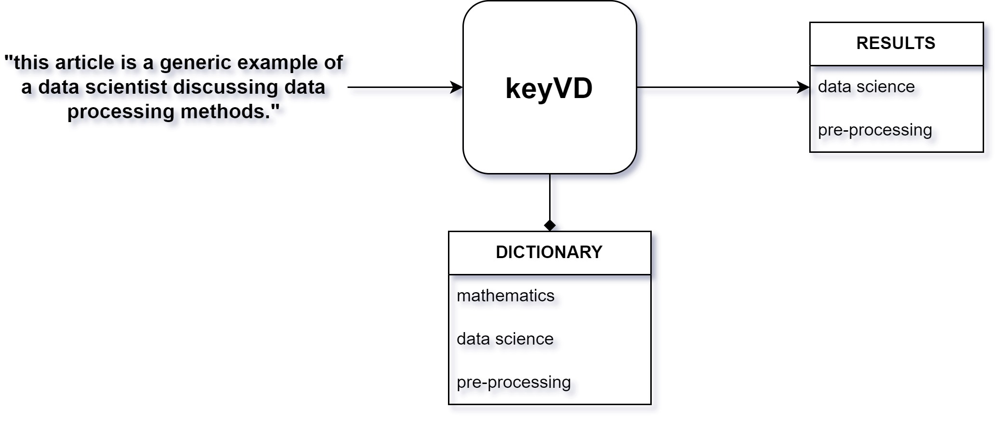

# `keyVD` - an unsupervised tool for dictionary-based keyword generation



`keyVD` is a python toolkit openly available. Its purpose is to extract keywords and generate standardized indexes for documents of any type, relying on a dictionary defined by the user. The toolkit offers a complete process from text processing up to index standardization.

## Table of Contents

* [Installation](#installation)
* [Example](#example)
* [Benchmarking](#benchmarking)

## Installation

To pip install `keyVD` from github:

```bash
pip install git+https://github.com/saberzahhar/keyVD.git
```

`keyVD` relies on classic packages such as `gensim`, `nltk`, `numpy` or even `scipy` for text processing and calculations.

```bash
# install the required packages
pip install -r requirements.txt
```

## Example

```python

# 0/ define variables and import module
text="this article is a generic example of a data scientist discussing pre processing methods." # can also be a path to a .txt file
vocabulary="pre-processing;data science;mathematics" # can also be a path to a .txt file
parameters={"vector_size":300, "window":3, "min_count":1, "n_grams":3} # default values
n_keys=5 # default value

from keyVD import *

# 1/ create a KeyVD keywords generator.
generator = KeyVD()

# 2/ load contents into the generator object.
generator.load_vocabulary(vocabulary=vocabulary, 
                          sep=";")
generator.load_text(text=text,
                    vector_size=parameters["vector_size"], 
                    window=parameters["window"], 
                    min_count=parameters["min_count"],
                    n_grams=parameters["n_grams"])

# 3/ extract the n_keys-best cluster candidates and map them to our vocabulary.
indexes = generator.keywords_generation(n_keys=n_keys)
print(";".join(indexes))
```

## Benchmarking

A detailed example for benchmarking is provided in the [`notebooks/`](notebooks/) directory:

- [a_datasets](notebooks/a_datasets.ipynb): create inputs.csv and outputs.csv containing data about texts, gold keywords and potential vocabularies.
- [b_predictions](notebooks/b_predictions.ipynb): create predictions.csv containing data about model predictions.
- [c_evaluations](notebooks/c_evaluations.ipynb): evaluation metrics and visualization for all models.

Note: you can use the [setup.json](setup.json) file to modify parameters and activate compatibility with Google Cloud's BigQuery, the notebook's identifier should have all the required access to the project specifid in the parameters.